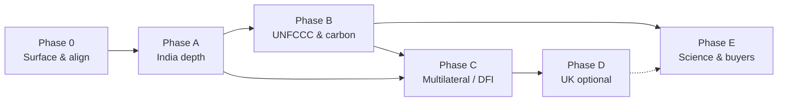

# Aranyix — Compliance & Framework Roadmap

Phased plan to expand **MRV, safeguards, and audit-ready exports** across India, UNFCCC, multilateral funders, and (optionally) UK buyers — without becoming a credit registry or legal certifier.

**Positioning (unchanged):** Aranyix prepares evidence, checklists, and exports for third-party review. We do not issue credits, certify ISO/BRSR/TNFD compliance, or register projects with UNFCCC/Verra.

**Related docs:** `docs/PHASE5_REPORTING_CREDITS_AUDIT.md`, `docs/ROADMAP.md`, `backend/app/services/reports/frameworks.py`, `backend/app/services/compliance/checklists.py`, `backend/app/services/schemes/registry.py`

---

## Phase sequence



| Phase | When | Effort | Risk if skipped |
|-------|------|--------|-----------------|
| **0** | Now | Low — mostly UI/CMS wiring | Homepage and `/reports` under-sell shipped capabilities |
| **A** | Next | Medium — safeguards module is net-new | India govt/co-op audits fail on tenure/FPIC, not tree counts |
| **B** | After A (partial overlap OK) | Medium–high — Article 6 metadata | Carbon buyers cannot trace integrity beyond VM0047 |
| **C** | After A2 safeguards | Medium | DFI/NHAI/CAMPA projects lack WB ESF / UNDP SES packs |
| **D** | Sales-gated | Medium | UK-listed buyers need WCC/BNG/ISSB evidence |
| **E** | Ongoing | Medium — external APIs (GBIF/IUCN) | Competitors catch up on nature + FLAG narratives |

**Parallel streams after Phase 0:** exports (B), safeguards (A→C), India portals/BRSR (A), marketing/CMS (continuous), UK/science (D/E optional).

---

## Current baseline (already shipped)

| Layer | What exists today |
|-------|-------------------|
| **India schemes** | CAMPA, NHAI, Nagar Van, Sahakar Van, GIM, MISHTI, MGNREGA, Jal Shakti, Green Credit India (`schemes/registry.py`) |
| **Reports UI** | BRSR, ISO 14064-2, TNFD, GHG Protocol, Darwin Core, VM0047 ledger, inventory, carbon, biodiversity, ESG, executive digest, signed evidence |
| **Framework profiles** | IPCC AR6, VM0047, Gold Standard LUF, REDD+, Paris/NDC, NGT/CAMPA, ESG, GIM, MISHTI, Nagar Van, Green Credit, Sahakar Van |
| **Checklists** | VM0047, GS LUF, REDD+, NGT/CAMPA, ICVCM CCP, scheme-specific (GIM, MISHTI, Nagar Van, Green Credit, Sahakar Van, MGNREGA) |
| **Integrity** | Audit chain, evidence bundles (Ed25519), NPRT buffer, plot monitoring, DPDP privacy workflows |

**Gap:** Several backend capabilities are not yet first-class in marketing, homepage CMS, or `/reports` tabs (Gold Standard export, REDD+, Paris/NDC, Green Credit pack).

---

## Roadmap overview

| Phase | Theme | Primary outcome |
|-------|--------|-----------------|
| **0** | Surface & align | Homepage, CMS, and reports UI match what code already does |
| **A** | India regulatory depth | Green Credit, FRA/tenure, e-Greenwatch-style exports, BRSR Core KPIs |
| **B** | UNFCCC & carbon integrity | Article 6 traceability, ETF/BTR handoff, REDD+ & GS as report tabs |
| **C** | Multilateral & DFI | World Bank ESF PS5/6, UNDP SES safeguards module |
| **D** | UK market (optional) | Woodland Carbon Code, BNG, ISSB S1/S2 evidence packs |
| **E** | Science & buyer differentiation | SBTi FLAG, GBF, GBIF/IUCN, EUDR supplier MRV |

Phases are **sequential at the product level** but engineering work inside a phase can run in parallel streams (backend / frontend / CMS / checklists).

---

## Phase 0 — Surface & align (foundation)

**Goal:** Stop under-selling shipped frameworks. One evidence graph → many export faces.

### Deliverables

| # | Deliverable | Type | Notes |
|---|-------------|------|-------|
| 0.1 | Homepage compliance + reports sections list **all live framework profiles** | CMS / marketing | Map chips to checklist groups; no new backend |
| 0.2 | `/reports` tabs for **Gold Standard LUF**, **REDD+**, **Paris/NDC** | Frontend | Wire to existing `GET /api/v1/reporting/projects/{id}/framework-report?profile=…` |
| 0.3 | **Green Credit India** export card + scheme wizard copy | CMS + reports | Profile `green_credit_india` already in `frameworks.py` |
| 0.4 | Compliance project UI: show **recommended checklist** from scheme + segment | UX | Uses `workflow.py` segment → checklist mapping |
| 0.5 | Framework profile picker documents **reference + disclaimer** on every export | UX polish | Already in profile metadata |
| 0.6 | Migration refresh when CMS defaults change | Ops | Pattern: `0049_refresh_homepage_reports` |

### Exit criteria

- [ ] Every profile in `FRAMEWORK_PROFILES` is reachable from UI or documented API
- [ ] Homepage report count matches `/reports` tabs (no “ghost” frameworks in code only)
- [ ] Scheme setup wizard names Green Credit, GIM, MISHTI, Sahakar Van alongside CAMPA/NHAI

### Dependencies

None — uses existing engine.

---

## Phase A — India regulatory depth

**Goal:** Win government and corporate India audits where projects fail on **tenure, safeguards, and portal-shaped evidence**, not tree counts.

### A1 — MoEFCC Green Credit Programme (GCP)

| Deliverable | Detail |
|-------------|--------|
| GCP structured export | Land bank ID, verifier sampling plan, survival/geo KPIs aligned to Green Credit Rules 2023 |
| GCP checklist hardening | Extend `green_credit_india` checklist with auto-checks from project metadata |
| Registrar handoff fields | JSON/XLSX column map for state/MoEFCC portals (manual upload first; API later if published) |

**Code touchpoints:** `green_credit_india` scheme, checklist, framework profile.

### A2 — Safeguards & tenure (FRA / community)

| Deliverable | Detail |
|-------------|--------|
| **Safeguards module** (new) | Document store: gram sabha resolution, FPIC minutes, Patta/CFR references, stakeholder consultation log |
| FRA checklist | New checklist code `fra_tenure` linked to CAMPA, Nagar Van, Sahakar Van, MGNREGA schemes |
| Compliance tab UX | “Safeguards” sub-panel with required docs per scheme template |
| Audit events | `safeguards.document.upload`, `safeguards.checklist.complete` |

**Why now:** NGT/CAMPA and cooperative schemes increasingly ask for tenure proof before survival statistics.

### A3 — Biological Diversity Act / NBA (lightweight)

| Deliverable | Detail |
|-------------|--------|
| Species flag on registration | Exotic / medicinal / scheduled species → triggers NBA benefit-sharing acknowledgment field |
| Checklist items on VM0047 / GS / Green Credit | Non-blocking “partial” answers allowed; strict mode for govt schemes |

### A4 — e-Greenwatch / State CAMPA alignment

| Deliverable | Detail |
|-------------|--------|
| **State CAMPA export pack** | Pre-shaped tables: geo-tagged %, survival %, fund utilization refs, violation status |
| NGT order reference field | On project metadata (`ngt_order_ref`, `state_campa_account` — partial fields exist) |

### A5 — BRSR depth (SEBI)

| Deliverable | Detail |
|-------------|--------|
| BRSR **Core KPI** mapping layer | Map plantation metrics → Principle 6 indicators + essential indicators where applicable |
| Value-chain annex | Supplier/project linkage for Scope 3 nature & climate evidence (read-only export) |

### Exit criteria

- [ ] Green Credit project can export a verifier-ready pack without custom spreadsheets
- [ ] CAMPA/Nagar Van project can attach FRA/FPIC evidence and show checklist completion
- [ ] BRSR export references Core KPI IDs where data exists

### Dependencies

Phase 0 complete (exports visible). Safeguards module is net-new schema + UI.

---

## Phase B — UNFCCC & carbon integrity

**Goal:** Support national and voluntary carbon conversations — **Article 6, REDD+, ETF** — without operating as a registry.

### B1 — REDD+ & Gold Standard as first-class reports

| Deliverable | Detail |
|-------------|--------|
| `/reports` REDD+ tab | PDF/XLSX from `redd_plus` profile + checklist auto-fill |
| `/reports` Gold Standard tab | Same for `gold_standard_luf` |
| Homepage + compliance chips | REDD+, GS LUF alongside VM0047 / ICVCM |

### B2 — Paris Agreement Article 6 / corresponding adjustments

| Deliverable | Detail |
|-------------|--------|
| Extend `paris_ndc` profile → **Article 6 module** | Authorized mitigation outcomes, corresponding adjustment flags, ITMO-style serial references (informational ledger) |
| Checklist `article6_readiness` | Cooperative approaches, double-counting avoidance, host-country authorization placeholder |
| Credit ledger metadata | Link ledger rows to Art. 6 authorization status (no issuance claim) |

### B3 — Enhanced Transparency Framework (ETF) / BTR handoff

| Deliverable | Detail |
|-------------|--------|
| **National inventory handoff export** | IPCC-aligned activity tables: land use, removals, uncertainty flags, QA/QC notes |
| Portfolio aggregation | Org-level roll-up for state/MoEFCC pilot partners |

### B4 — Leakage & permanence (cross-framework)

| Deliverable | Detail |
|-------------|--------|
| Leakage assessment worksheet | Shared by VM0047, REDD+, SBTi FLAG prep |
| Permanence dashboard | SAR integrity + mortality buffer + NPRT score in one compliance view |
| Alert → checklist link | SAR canopy alert auto-marks REDD+/VM0047 monitoring items “partial” |

### Exit criteria

- [ ] REDD+ and GS exports available from project Compliance tab and org Reports
- [ ] Article 6 module produces traceability report with disclaimer (no registry API)
- [ ] ETF handoff CSV validates against internal IPCC AR6 profile sections

### Dependencies

Phase A safeguards (B2/B4 overlap). Satellite + credit ledger already exist.

---

## Phase C — Multilateral & development finance

**Goal:** Match **World Bank ESF** and **UNDP SES** expectations for NHAI, CAMPA, and DFI-backed green corridors.

### C1 — World Bank Environmental & Social Framework

| Deliverable | Detail |
|-------------|--------|
| **ESF screening checklist** | Map PS1–PS8 at level appropriate for plantation (focus **PS5** land/tenure, **PS6** biodiversity) |
| PS6 evidence pack | Bioacoustic richness + NDVI habitat + native species mix from existing data |
| PS5 evidence pack | Overlap with Phase A safeguards module |

### C2 — UNDP Social & Environmental Standards (SES)

| Deliverable | Detail |
|-------------|--------|
| SES risk screening template | Low/medium/high + required mitigation actions |
| Stakeholder engagement log | Reuse safeguards module; SES-specific export layout |

### C3 — DFI project template

| Deliverable | Detail |
|-------------|--------|
| Combined **Multilateral audit pack** | Single ZIP: ESF + SES + NGT/CAMPA + satellite + signed evidence |
| Scheme template | Optional `dfi_green_corridor` rule template for NHAI + CAMPA convergence projects |

### Exit criteria

- [ ] Pilot project can generate ESF PS5/PS6 evidence pack from platform data
- [ ] UNDP SES screening PDF exports with stakeholder log attached

### Dependencies

**Phase A2 Safeguards module** (required). Phase B leakage/permanence strengthens PS6.

---

## Phase D — UK market (optional)

**Goal:** Serve UK-listed buyers and diaspora ESG teams reporting on **Indian supply-chain plantations**.

Only prioritize if sales target UK corporates or UK verification partners.

### D1 — UK Woodland Carbon Code (WCC)

| Deliverable | Detail |
|-------------|--------|
| WCC framework profile + checklist | Parallel to VM0047 (buffer, permanence, stratification) |
| WCC export | PDF/XLSX with UK-specific disclaimer |

### D2 — Biodiversity Net Gain (BNG)

| Deliverable | Detail |
|-------------|--------|
| Habitat condition scorer v1 | NDVI + bioacoustic + species → habitat condition proxy (not full DEFRA calculator) |
| BNG evidence export | Maps to metric habitat units narrative for UK advisors |

### D3 — ISSB IFRS S1/S2

| Deliverable | Detail |
|-------------|--------|
| ISSB evidence pack | Climate (S2) + cross-cutting (S1) tables fed from same org evidence graph |
| Bridge from BRSR | Mapping table BRSR Principle 6 ↔ ISSB disclosures |

### Exit criteria

- [ ] WCC checklist completable on a UK-pilot project (can use India plantation data structurally)
- [ ] BNG export generates advisor-readable habitat narrative

### Dependencies

Phase B ETF/IPCC tables help ISSB. Bioacoustic stack required for BNG.

---

## Phase E — Science & buyer differentiation

**Goal:** Long-term moat — standards competitors rarely combine with **SAR + bioacoustics + field chainage**.

### E1 — SBTi FLAG (Forest, Land & Agriculture)

| Deliverable | Detail |
|-------------|--------|
| FLAG target worksheet | Land-related emissions/removals vs target boundary |
| Link to VM0047 / GHG exports | Single source of truth for land-sector numbers |

### E2 — Kunming-Montreal Global Biodiversity Framework (GBF)

| Deliverable | Detail |
|-------------|--------|
| GBF indicator mapping | Targets 2 (restore) & 3 (protect) narrative from portfolio metrics |
| TNFD bridge | GBF section in TNFD LEAP export |

### E3 — GBIF + IUCN enrichment

| Deliverable | Detail |
|-------------|--------|
| Darwin Core export + **IUCN Red List** status fields | Enrich BirdNET detections |
| GBIF publish workflow | Optional occurrence dataset submission prep |

### E4 — EU Deforestation Regulation (EUDR) — supplier MRV

| Deliverable | Detail |
|-------------|--------|
| Geo-coordinate due diligence pack | For corporate buyers proving plantation legality |
| Supplier linkage | BRSR value-chain + EUDR annex |

### E5 — ISO 14064-1 (organizational inventory)

| Deliverable | Detail |
|-------------|--------|
| Org-level GHG inventory export | Complements existing ISO 14064-2 **project** report |

### Exit criteria

- [ ] FLAG worksheet exports from org with ≥1 plantation project
- [ ] Darwin Core ZIP includes IUCN status where species match exists

### Dependencies

Phases A (BRSR value chain) and B (GHG/IPCC). GBIF/IUCN needs external API keys and caching policy.

---

## Cross-cutting modules (build once, reuse everywhere)

These span multiple phases — schedule as platform capabilities, not one-off exports.

| Module | Phases | Description |
|--------|--------|-------------|
| **Safeguards & tenure pack** | A, C | FPIC, FRA, WB PS5, GS safeguards, Cancun REDD+ |
| **Leakage & permanence engine** | B, E | Buffer, SAR, mortality, NPRT, SBTi FLAG inputs |
| **Article 6 / CA ledger** | B | Traceability without registry operations |
| **Supplier / value-chain MRV** | A, E | BRSR, EUDR, CDP Scope 3 narratives |
| **National inventory handoff** | B | ETF/BTR tables for MoEFCC/state pilots |
| **Multilateral mega-pack** | C | ESF + SES + NGT + evidence ZIP |

---

## Explicit non-goals (all phases)

Do **not** build unless product strategy changes:

- UNFCCC registry integration, Verra/GS **issuance**, or legal **certification** sign-off
- Full GRI Content Index automation (overlap with BRSR/ISSB is sufficient for India-first)
- CDM legacy workflows, ACR/CAR (US voluntary) unless client-funded
- Claiming World Bank **clearance** or UNDP ** accreditation** — evidence only
- PM-Gati Shakti GIS integration unless MoRTH/NHAI partnership exists

---

## Suggested engineering streams

Work can proceed in parallel once Phase 0 is done:

```
Stream 1 — Exports & profiles     Phase 0 → B1 → B2 → B3
Stream 2 — Safeguards & tenure      Phase A2 → C1 → C2
Stream 3 — India portals & BRSR     Phase A1 → A4 → A5
Stream 4 — Marketing/CMS            Phase 0 (continuous)
Stream 5 — UK / E / differentiation Phase D*, E* (optional)
```

---

## Homepage & compliance messaging (target end-state)

After Phase 0 + A + B, marketing should truthfully claim:

**India:** DPDP · BRSR · Green Credit · CAMPA/NGT · NHAI · FRA · GIM · Nagar Van · MISHTI · Sahakar Van  
**Carbon:** VM0047 · Gold Standard · IPCC · ICVCM · Article 6 · REDD+  
**Nature:** TNFD · GBF · Darwin/GBIF · BirdNET  
**Multilateral:** World Bank ESF · UNDP SES  
**UK (if Phase D):** WCC · BNG · ISSB  

---

## Tracking

| Phase | Doc owner | Backend epic label | CMS migration needed |
|-------|-----------|-------------------|----------------------|
| 0 | Product | `compliance-phase-0` | Yes — refresh homepage |
| A | Product + Legal review | `compliance-phase-a-india` | Yes — new report rows |
| B | Carbon/MRV | `compliance-phase-b-unfccc` | Yes |
| C | Gov/DFI | `compliance-phase-c-multilateral` | Optional |
| D | UK sales gated | `compliance-phase-d-uk` | If launched |
| E | Science | `compliance-phase-e-science` | Incremental |

Update this doc when a phase exits; link PRs to phase labels in commit messages for traceability.
