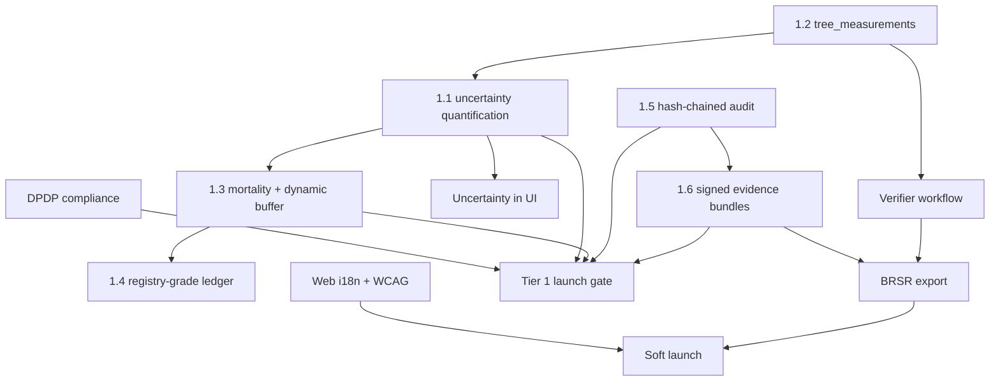

# BYOT — MRV Integrity & Launch Readiness Implementation Plan

This document turns the platform audit into an executable roadmap. It assumes work proceeds on `main` in **2-week sprints** and that **launch is blocked until Tier 1 exit criteria pass**.

**Strategic position (do not lose sight of this):**

> BYOT is the **audit-preparation layer** that speaks both Indian government schemes and international methodologies — and is **honest about what is measured versus estimated**.

Three differentiators to protect:

1. **Uncertainty as a feature** — show ranges and method disclosure, not fake precision.
2. **Independent verifier workflow** — attest without edit rights.
3. **BRSR + TNFD** — Indian corporate revenue + nature data competitors lack.

---

## Current state snapshot (`origin/main`)

| Area | Status | Key paths |
|---|---|---|
| Carbon engine (point estimates) | Implemented | `backend/app/services/carbon/engine.py` |
| Confidence score | Input-completeness heuristic only | `engine.py` → `CarbonResult.confidence` |
| Tree metrics | Single `current_*` columns, no history | `backend/app/models/tree.py` |
| Buffer pool | Hardcoded 20% (Verra) / 15% (GS) | `engine.py` → `BUFFER_POOL` |
| Credit ledger | Status machine, no serial/vintage/retirement | `backend/app/services/credits/ledger.py` |
| Evidence bundles | SHA-256 manifest, no signature/timestamp | `backend/app/services/evidence/bundle.py` |
| Audit logs | Append-only, not hash-chained | `backend/app/models/audit.py` |
| Web i18n | English only | `frontend/package.json` (no `next-intl`) |
| Mobile i18n | ~130 Hindi strings | `mobile/lib/l10n/` |
| Accessibility | Ad-hoc ARIA, no CI gate | `frontend/components/ui/` (thin) |

---

## Tier overview

| Tier | Theme | Sprints (approx.) | Launch gate? |
|---|---|---|---|
| **Tier 1** | Integrity & legal exposure | 1–6 | **Yes — all must pass** |
| **Tier 2** | Market access | 7–10 | Strongly recommended |
| **Tier 3** | Differentiation | 11–14 | Post-soft-launch OK |
| **Tier 4** | Scale & certification | 15+ | Ongoing |

---

# Tier 1 — Integrity and legal exposure

## Sprint 1–2: Measurement time-series (1.2)

**Problem:** `trees.current_*` is a snapshot. Auditors need repeated measurements of the same individual with provenance.

### Database

New migration `alembic/versions/xxxx_tree_measurements.py`:

```sql
tree_measurements (
  id UUID PK,
  tree_id UUID FK → trees,
  measured_at TIMESTAMPTZ NOT NULL,
  dbh_cm NUMERIC(6,2),
  height_m NUMERIC(6,2),
  canopy_m NUMERIC(6,2),
  method VARCHAR(32),          -- tape | caliper | clinometer | photogrammetry | ai_estimate
  instrument VARCHAR(64),      -- e.g. "Stanley 5m tape", "DJI LiDAR"
  measurer_id UUID FK → users,
  gps_accuracy_m NUMERIC(8,2),
  photo_key VARCHAR(512),      -- S3 object key
  notes TEXT,
  uncertainty_dbh_pct NUMERIC(5,2),   -- per-field uncertainty inputs for 1.1
  uncertainty_height_pct NUMERIC(5,2),
  created_at TIMESTAMPTZ
)
CREATE INDEX ON tree_measurements (tree_id, measured_at DESC);
```

Keep `trees.current_*` as **materialised latest** — updated by service layer on insert, not by direct writes from clients.

### Backend

| File | Change |
|---|---|
| `backend/app/models/tree_measurement.py` | New model |
| `backend/app/schemas/tree_measurement.py` | Create/list/filter schemas |
| `backend/app/services/trees/measurements.py` | Insert, validate, sync `current_*` |
| `backend/app/api/v1/trees.py` | `POST /trees/{id}/measurements`, `GET /trees/{id}/measurements` |
| `backend/tests/test_tree_measurements.py` | CRUD + current_* sync |

### Mobile / Web

| Surface | Change |
|---|---|
| `mobile/lib/src/screens/survival_survey_screen.dart` | Write to measurements API, capture method + instrument |
| `mobile/lib/src/screens/add_tree_screen.dart` | Initial measurement row on registration |
| `frontend/components/trees/tree-measurements-panel.tsx` | Timeline chart + table |
| Field worker UX | DBH guidance overlay (measure at 1.3 m), photo quality hint |

### Exit criteria

- [ ] Every new tree registration creates at least one `tree_measurements` row
- [ ] Survival survey appends a row; `current_*` reflects latest
- [ ] API returns full measurement history for audit export
- [ ] Re-measurement does not overwrite prior rows

---

## Sprint 2–3: Uncertainty quantification (1.1) — highest-value gap

**Problem:** `confidence` in `CarbonResult` is input completeness (`engine.py` lines ~250–272), not propagated measurement uncertainty. Zero matches for `uncertainty|confidence_interval|std_error|margin_of_error` in backend today.

### Engine design

Extend `CarbonInputs` and `CarbonResult`:

```python
@dataclass
class CarbonResult:
    ...
    co2e_kg: float
    co2e_kg_lower_90: float      # 90% CI lower bound
    co2e_kg_upper_90: float      # 90% CI upper bound
    uncertainty_pct: float       # (upper - lower) / (2 * point) * 100
    verra_deduction_pct: float   # 0 if ≤15%, else per VM0047 table
    confidence: float            # rename internally to input_completeness; keep alias for compat
```

**Propagation chain:**

1. **Measurement error** — default σ by method (tape ±2%, caliper ±1%, photogrammetry ±5%, AI ±15%)
2. **Allometric RMSE** — species-specific from catalog or Chave 2014 regional RMSE
3. **Wood density variance** — species table σ or IPCC default
4. **Root-shoot uncertainty** — climate-zone σ on `R`
5. **Monte Carlo or analytical** — 10k draws or delta method; report 90% CI

**Verra VM0047 deduction:** when total uncertainty > 15%, apply methodology deduction to creditable quantity; store deduction in result notes + ledger metadata.

### Files

| File | Change |
|---|---|
| `backend/app/services/carbon/uncertainty.py` | **New** — propagation + Verra deduction |
| `backend/app/services/carbon/engine.py` | Wire uncertainty into `calculate()` |
| `backend/app/services/carbon/species_catalog.py` | Add `allometric_rmse`, `wood_density_std` per species |
| `backend/app/schemas/carbon.py` | Expose CI fields in API response |
| `backend/app/models/carbon.py` | Persist `co2e_lower_90`, `co2e_upper_90`, `uncertainty_pct` |
| `docs/CARBON_ENGINE.md` | Document math (auditor-facing) |
| `backend/tests/test_carbon_uncertainty.py` | **New** — CI bounds, Verra deduction edge cases |

### UI (minimum for Tier 1)

| File | Change |
|---|---|
| `frontend/components/carbon/carbon-estimate-card.tsx` | **New** — range display + method link |
| `mobile/lib/src/screens/carbon_screen.dart` | Show interval, not point value |
| All carbon KPI tiles | Replace `1,240 kg CO₂e` with `980–1,510 kg CO₂e (90% CI)` |

### Exit criteria

- [ ] Point estimate always lies within reported 90% CI
- [ ] Verra deduction applies automatically when uncertainty > 15%
- [ ] Method/instrument from `tree_measurements` flows into uncertainty calc
- [ ] `docs/CARBON_ENGINE.md` matches implementation (reproducible by third party)

---

## Sprint 3–4: Carbon accounting concepts (1.3)

**Problem:** Engine computes biomass and applies fixed buffer. Missing baseline, additionality, leakage, dynamic NPRT, mortality, other pools, ex-ante vs ex-post.

### Phase A — Mortality & dynamic buffer (Tier 1 scope)

| Deliverable | Detail |
|---|---|
| **Survival/mortality model** | Annual survival rate by species, ecozone, plantation age; decay lifetime credits |
| **Dynamic buffer %** | `non_permanence_risk_rating` per project (fire, drought, tenure, management); maps to buffer 10–30% per Verra AFOLU NPRT guidance |
| **Ex-ante vs ex-post** | Split `CarbonResult` into `projected_*` and `verified_*`; ledger only credits ex-post |

New tables:

```
project_risk_assessments (project_id, nprt_score, buffer_pct, assessed_at, assessor_id, factors JSONB)
tree_survival_events (tree_id, event_at, status: alive|dead|removed, cause, evidence_key)
```

Files: `backend/app/services/carbon/mortality.py`, `backend/app/services/carbon/buffer.py`, extend `engine.py`.

### Phase B — Full VM0047 structure (Tier 2, but design now)

| Concept | Table / service | Sprint |
|---|---|---|
| Baseline scenario | `project_baselines` | Tier 2 |
| Additionality | `additionality_assessments` + checklist | Tier 2 |
| Leakage | `leakage_accounts` | Tier 2 |
| Other pools (deadwood, litter, SOC) | `carbon_pools` extension | Tier 3 |
| GHG Protocol Land Sector alignment | `backend/app/services/carbon/ghg_protocol.py` | Tier 3 |

### Exit criteria (Tier 1)

- [ ] Lifetime credits use mortality-adjusted projection (not infinite survival)
- [ ] Buffer % comes from project risk assessment, not constant 20%
- [ ] UI shows ex-ante projection vs ex-post verified separately
- [ ] Tests: 10% mortality over 5 years reduces lifetime credits measurably

---

## Sprint 4–5: DPDP compliance (Part 2.1 + Part 4)

**Problem:** Checkbox consent only; no consent ledger, data export, erasure, or grievance workflow.

### Database

```
consent_records (user_id, purpose, policy_version, granted_at, withdrawn_at, ip, user_agent)
data_subject_requests (id, user_id, type: access|correction|erasure|portability, status, created_at, completed_at, handler_id)
grievance_tickets (id, user_id, subject, body, status, officer_id, resolution)
```

### Backend

| Endpoint | Purpose |
|---|---|
| `POST /api/v1/privacy/consent` | Record consent |
| `DELETE /api/v1/privacy/consent/{purpose}` | Withdraw |
| `POST /api/v1/privacy/data-requests` | Submit DSR |
| `GET /api/v1/me/data-export` | Async zip (JSON + CSV) |
| `POST /api/v1/me/delete-account` | Erasure queue with retention exceptions |
| `POST /api/v1/privacy/grievances` | Grievance filing |

Files: `backend/app/services/privacy/`, `backend/app/api/v1/privacy.py`, CMS update for DPDP notice in `backend/app/services/cms/legal.py`.

### Frontend / Mobile

- Settings → Privacy: download data, delete account, manage consent
- Signup: consent tied to `policy_version`
- CMS: grievance officer contact block

### Exit criteria

- [ ] User can export all personal data within documented SLA (e.g. 72 h)
- [ ] Consent withdrawal stops non-essential processing (marketing, analytics)
- [ ] Erasure preserves audit/credit records with PII redaction
- [ ] Legal review sign-off on notice text

---

## Sprint 5–6: Tamper-evident audit + signed evidence (1.5, 1.6)

### Hash-chained audit log

Extend `backend/app/models/audit.py`:

```
audit_logs: add prev_hash VARCHAR(64), record_hash VARCHAR(64)
```

On insert: `record_hash = SHA256(prev_hash + canonical_json(row))`. First row uses genesis hash.

New: `backend/app/services/audit/chain.py` — append, verify chain, daily root hash.

Cron: publish daily root to S3 public bucket or transparency log; optional webhook.

### Signed evidence bundles

Extend `backend/app/services/evidence/bundle.py`:

1. Hash **zip bytes**, not manifest list
2. Detached **Ed25519** signature (key in KMS / env)
3. **RFC 3161** timestamp from TSA (configurable; stub in dev)
4. Publish public key at `/api/v1/evidence/signing-key` and CMS page

For India govt: optional CCA e-Sign / DSC adapter (`backend/app/services/signing/india_esign.py`) — Tier 3.

### Exit criteria

- [ ] Tampering any audit row breaks chain verification
- [ ] Daily root hash published automatically
- [ ] Evidence bundle verification CLI/script for auditors
- [ ] Modified zip fails signature verification

---

# Tier 2 — Market access

## Sprint 7–8: Registry-grade credit ledger (1.4)

**Problem:** Ledger has status transitions but no serial, vintage, retirement, custody, or double-counting prevention.

### Database

```
credit_serials (
  id, serial_number UNIQUE,  -- e.g. BYOT-2026-IN-MH-000001
  ledger_entry_id, vintage_year, tco2e_amount,
  status: available|retired|cancelled,
  retired_at, beneficiary, retirement_reason,
  paris_article6 BOOLEAN, corresponding_adjustment_ref
)
claim_registry (
  id, tree_id, scheme_code, claim_type, exclusive BOOLEAN,
  valid_from, valid_to, ledger_entry_id,
  UNIQUE (tree_id, scheme_code) WHERE exclusive AND valid_to IS NULL
)
credit_transfers (from_org, to_org, serial_id, transferred_at, custody_hash)
```

### Service rules

- One tree → at most one **exclusive** active claim per scheme family (CAMPA vs Green Credit vs corporate ESG)
- Retirement is terminal; certificate PDF with serial + beneficiary
- Vintage = monitoring period end year

Files: extend `ledger.py`, new `backend/app/services/credits/serials.py`, `claims.py`.

### Exit criteria

- [ ] Attempt to double-claim same tree in two exclusive schemes fails with clear error
- [ ] Retirement generates verifiable certificate
- [ ] Serial numbers are globally unique and auditable

---

## Sprint 7–8: Verifier role & workflow (Part 4)

**Problem:** No independent reviewer who can attest without editing measurements.

### RBAC

New role: `verifier` (org-scoped or platform VVB).

Permissions: `measurement:read`, `measurement:attest`, `measurement:reject` — **not** `measurement:write`.

### Workflow

```
verification_samples (project_id, sample_pct, method: random|stratified, created_by)
verification_items (sample_id, tree_id, status: pending|approved|rejected, verifier_id, signed_at, notes)
```

- Supervisor creates sample (e.g. verify 10% of trees)
- Verifier field-checks, approves/rejects with optional e-Sign (Tier 3)
- Measurements remain immutable; attestation is a separate signed record

Files: `backend/app/services/verification/`, `frontend/app/(app)/verification/`, mobile read-only verifier queue.

### Exit criteria

- [ ] Verifier cannot edit tree DBH via API (403)
- [ ] Attestation appears on evidence bundle and public verify page
- [ ] Sample-based audit report exportable as PDF

---

## Sprint 8–9: BRSR export (2.1 — enterprise unlock)

**Problem:** No BRSR (SEBI) structured export for top-1000 listed companies.

### Deliverables

| Output | Detail |
|---|---|
| BRSR Core mapping | Map BYOT fields → Principle 6 (environment) indicators |
| Assurance-ready pack | Evidence bundle + uncertainty CI + verifier attestation |
| API | `POST /api/v1/reports/brsr` → Excel + JSON |

Files: `backend/app/services/reports/brsr.py`, `frontend/app/(app)/reports/page.tsx` (BRSR tab).

Reference: SEBI BRSR Core 2024 assurance requirements.

### Exit criteria

- [ ] Sample BRSR export validated against SEBI template structure
- [ ] Includes scope/category tags for GHG inventory line items
- [ ] Corporate buyer can grant auditor read-only access

---

## Sprint 9–10: ISO 14064-2 structure + Web i18n + WCAG (2.2, 3.1, 3.2)

### ISO 14064-2

Project-level GHG quantification document generation:

- Organize by project boundary, baseline, quantification approach, uncertainty assessment, monitoring plan
- Files: `backend/app/services/reports/iso14064.py`

### Web internationalization

1. Add `next-intl` to `frontend/`
2. Extract strings from auth, dashboard, tree flows first
3. Ship **Hindi**, then **Marathi, Tamil, Telugu** (Tier 2); Bengali, Kannada, Gujarati (Tier 3)
4. Locale-aware lakh/crore vs million formatting
5. Sync language preference with mobile via user profile API
6. Indic font stack in `globals.css` (Noto Sans Devanagari, etc.)

### WCAG 2.2 AA (core flows)

Scope: auth, register tree, dashboard, reports, settings.

| Task | Detail |
|---|---|
| Radix primitives | `@radix-ui/react-dialog`, `dropdown-menu`, `tabs` — replace ad-hoc modals |
| axe-core in CI | Fail on critical violations in `.github/workflows/ci.yml` |
| Charts | Data table alternative beside every Recharts chart |
| Maps | Keyboard-navigable list fallback for tree map |
| Focus | Visible focus rings; `prefers-reduced-motion` |
| GIGW | Document alignment for govt buyers (RPwD 2016) |

### Exit criteria

- [ ] Hindi complete on auth + dashboard + tree registration
- [ ] axe-core: zero critical on scoped routes
- [ ] ISO 14064-2 project report generates for sample project

---

# Tier 3 — Differentiation

## Sprint 11–12: TNFD + GHG Protocol Land Sector + Darwin Core

| Standard | Build |
|---|---|
| **TNFD** | Nature disclosure report from bioacoustic + IUCN + NDVI: LEAP structure (Locate, Evaluate, Assess, Prepare) |
| **GHG Protocol Land Sector (2024)** | Align removals reporting with corporate inventory expectations |
| **Darwin Core** | Export species observations as DwC-A for GBIF publish |
| **STAC catalog** | Expose plantation NDVI tiles + evidence bundles as STAC items |
| **OGC API Features** | GeoJSON/Shapefile bulk export; WMTS for forest dept GIS |

Files: `backend/app/services/reports/tnfd.py`, `backend/app/services/biodiversity/darwin_core.py`, `backend/app/api/v1/ogc.py`.

---

## Sprint 12–13: India Stack + Green Credit Rules

| Integration | Priority | Notes |
|---|---|---|
| **Green Credit Rules 2023** | High | Live registry; GC computation (trees/ha, 5-yr rules) |
| **e-Sign / DSC** | High | Verifier sign-off on bundles |
| **DigiLocker** | Medium | Land record verification |
| **Aadhaar e-KYC** | Medium | Field staff onboarding (only if contract requires) |
| **Bhuvan WMS** | Medium | Extend existing Bhoonidhi integration |

---

## Sprint 13–14: Full VM0047 + ICVCM

- Baseline, additionality, leakage modules (from 1.3 Phase B)
- **ICVCM Core Carbon Principles** alignment checklist in compliance UI
- Other carbon pools (deadwood, litter, SOC) in engine

---

# Tier 4 — Scale

| Item | Detail |
|---|---|
| Design system | Radix-based `Button`, `Input`, `Select`, `Dialog`, `Table`, `Tabs`, `Toast`, `Badge`, `Card`, `Skeleton` |
| PWA | Service worker + manifest; offline tree list for supervisors |
| Stratified sampling | Plot-based alternative to full census |
| SOC 2 / ISO 27001 | Control matrix mapped to existing audit logs + access controls |
| iOS mobile | Per `mobile/docs/ANDROID_FREEZE_IOS_ROADMAP.md` |
| NISAR live feed | When operational; swap stub provider |

---

# Part 4 — User perspective checklist

## Citizen / landowner (BYOT)

| Item | Tier | Notes |
|---|---|---|
| Honest copy: estimates ≠ sellable credits | 1 | Homepage, carbon screen, signup |
| Shareable impact certificate + public verify link | 1 | Extend `public_verification/builder.py` |
| Local-language UI | 2 | Hindi first |
| WhatsApp share | 2 | Mobile deep link |
| Tree photo timeline | 1 | From `tree_measurements` + images |
| Data rights self-service | 1 | DPDP export/delete |

## Field worker

| Item | Tier | Notes |
|---|---|---|
| DBH measurement guidance (1.3 m) | 1 | In-app overlay |
| Photo quality checks | 1 | Blur/brightness heuristic |
| Method + instrument capture | 1 | Required for MRV |
| Voice input (local language) | 3 | Speech-to-text |
| Low-end device / battery-aware GPS | 2 | Reduce poll interval on low battery |
| Daily task targets | 2 | Supervisor dashboard |

## Supervisor / verifier

| Item | Tier | Notes |
|---|---|---|
| Verifier role | 2 | See above |
| Sample-based audit workflow | 2 |  |
| e-Sign attestation | 3 |  |
| Discrepancy tracking | 2 |  |

## Corporate ESG buyer

| Item | Tier | Notes |
|---|---|---|
| BRSR export | 2 |  |
| GHG Protocol inventory line items | 3 |  |
| Assurance-ready evidence pack | 1–2 | Signed bundles |
| Auditor read-only access | 2 | Role: `external_auditor` |
| TNFD nature disclosures | 3 | Bioacoustic advantage |

## Government / forest department

| Item | Tier | Notes |
|---|---|---|
| ISFR-aligned canopy classes | 3 | FSI reconciliation |
| Divisional hierarchy (circle → beat) | 2 | Extend org model |
| DigiLocker land linkage | 3 |  |
| Bulk GIS export (Shapefile/GeoJSON) | 2 |  |
| WMS layers | 3 | Bhuvan |
| e-Sign submissions | 3 |  |

---

# Dependency graph (critical path)



---

# Sprint calendar (reference)

| Sprint | Focus | Key deliverables |
|---|---|---|
| 1–2 | Measurements | `tree_measurements` table, API, mobile capture |
| 2–3 | Uncertainty | CI propagation, Verra deduction, UI ranges |
| 3–4 | Carbon concepts | Mortality, dynamic buffer, ex-ante/ex-post |
| 4–5 | DPDP | Consent ledger, export, erasure, grievance |
| 5–6 | Audit integrity | Hash chain, signed bundles, TSA timestamp |
| 7–8 | Credits + verifier | Serials, claim registry, verifier role |
| 8–9 | BRSR | Enterprise export |
| 9–10 | ISO + i18n + a11y | Hindi web, WCAG core, ISO 14064-2 report |
| 11–14 | Tier 3 | TNFD, India Stack, ICVCM, full VM0047 |
| 15+ | Tier 4 | PWA, design system, SOC 2 |

At **2 weeks per sprint**, Tier 1 ≈ **12 weeks**, Tier 1+2 ≈ **20 weeks**.

---

# Launch gates

Do **not** set a public launch date until all pass:

### Gate A — Tier 1 (mandatory)

- [ ] Measurements: full time-series with method/instrument
- [ ] Carbon: 90% CI on all CO₂e displays; Verra deduction wired
- [ ] Mortality-adjusted lifetime credits; dynamic buffer from risk
- [ ] DPDP: export, delete, consent ledger, grievance
- [ ] Audit: hash chain verifies; evidence bundles signed + timestamped
- [ ] Copy: no implied sellable credits for citizen estimates

### Gate B — Soft launch (recommended)

- [ ] Verifier workflow live
- [ ] BRSR export beta
- [ ] Hindi web on core flows
- [ ] WCAG: zero critical axe violations on core routes
- [ ] Claim registry prevents double-counting

### Gate C — Enterprise / gov

- [ ] TNFD report from bioacoustic data
- [ ] ISO 14064-2 + ICVCM checklist
- [ ] India Stack (e-Sign minimum)
- [ ] GIGW accessibility documentation

---

# Ticket template (for GitHub Issues)

```markdown
## Summary
[One line]

## Tier / Sprint
Tier 1 | Sprint 2

## Standards
VM0047 §X, DPDP Art. Y

## Acceptance criteria
- [ ] ...
- [ ] ...

## Files
- backend/app/services/...
- frontend/components/...

## Depends on
#123
```

---

# Related docs

| Doc | Relationship |
|---|---|
| `docs/ROADMAP.md` | Original feature phases — superseded for launch planning by this doc |
| `docs/CARBON_ENGINE.md` | Update when 1.1 ships |
| `docs/SECURITY.md` | Align claims with DPDP + audit chain work |
| `docs/DATABASE_SCHEMA.md` | Update with new tables |
| `mobile/docs/MOBILE_PRODUCT_JOURNEY.md` | Field worker + verifier UX |

---

*Last updated: 2026-08-14. Target branch: `main`.*
