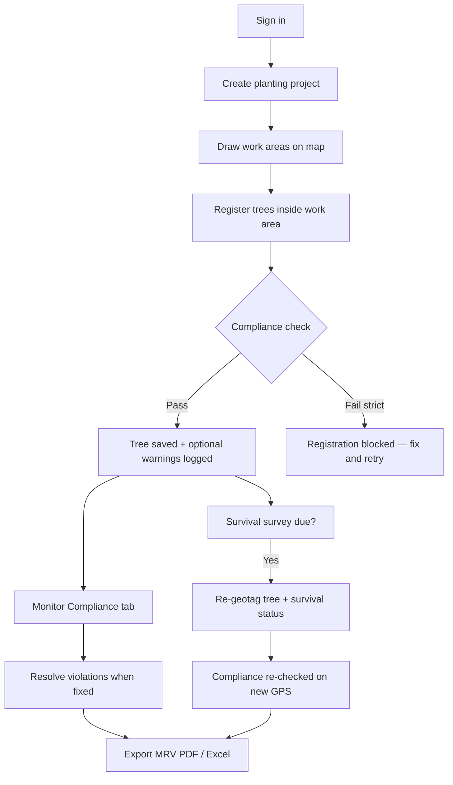

# Aranyix Phase 1 — User Manual & Process Guide

This guide walks field teams, project managers, and compliance officers through **Phase 1** on the web platform: planting projects, NHAI/ESG compliance, tree registration, survival surveys, and MRV export.

**Platform URL:** https://aranyix.tech/  
**Applies to:** Web app (desktop / tablet browser). Mobile app is planned for a later phase.

---

## Table of contents

1. [What Phase 1 covers](#1-what-phase-1-covers)
2. [Roles & access](#2-roles--access)
3. [End-to-end process](#3-end-to-end-process)
4. [Step 1 — Sign in & enable programs](#4-step-1--sign-in--enable-programs)
5. [Step 2 — Create a planting project](#5-step-2--create-a-planting-project)
6. [Step 3 — Draw work areas on the map](#6-step-3--draw-work-areas-on-the-map)
7. [Step 4 — Register trees (compliant)](#7-step-4--register-trees-compliant)
8. [Step 5 — Monitor compliance violations](#8-step-5--monitor-compliance-violations)
9. [Step 6 — Survival survey & re-geotag](#9-step-6--survival-survey--re-geotag)
10. [Step 7 — Export MRV / compliance report](#10-step-7--export-mrv--compliance-report)
11. [Step 8 — Project settings & lifecycle](#11-step-8--project-settings--lifecycle)
12. [Compliance modes explained](#12-compliance-modes-explained)
13. [NHAI vs ESG rule checklist](#13-nhai-vs-esg-rule-checklist)
14. [Troubleshooting](#14-troubleshooting)
15. [Quick reference — URLs & tabs](#15-quick-reference--urls--tabs)

---

## 1. What Phase 1 covers

| Capability | Description |
|------------|-------------|
| **Planting projects** | Organize work by contract / package (e.g. NH-44 Package 3) |
| **Work areas** | Polygon (green belt) or corridor (highway) boundaries on satellite map |
| **Standards templates** | NHAI highway, industrial green belt, township, NGO, general |
| **Compliance engine** | Real-time checks at tree registration and re-geotag |
| **Violations log** | Track, review, and resolve compliance issues |
| **Survival survey** | Periodic GPS re-check + survival status (live / stressed / dead) |
| **MRV export** | PDF or Excel bundle for auditors (trees, violations, work areas) |
| **Alerts** | Email reminders for due survival surveys (if enabled) |

**Not in Phase 1 (web):** Full mobile field app with project linking — planned after web completion.

---

## 2. Roles & access

| Role | Typical user | Phase 1 access |
|------|--------------|----------------|
| **Government / Corporate / NGO** | Project owner, compliance lead | Create projects, register trees, export MRV |
| **Farmer / User** | Field planter | Register trees in assigned programs |
| **Admin / Superadmin** | Platform operator | All data + admin console (if enabled) |

You need an account at https://aranyix.tech/login. For NHAI/ESG projects, ensure your account has the correct **registration program** enabled under **Settings → Registration programs** (e.g. *Government NHAI* or *Corporate ESG*).

---

## 3. End-to-end process

**Typical timeline**

| When | Action |
|------|--------|
| Project kickoff | Create project → draw all work areas |
| Daily / weekly | Register new trees in correct work area |
| Ongoing | Review Compliance tab; resolve fixed issues |
| Every 15 or 30 days | Re-geotag trees for survival survey |
| Monthly / audit | Download MRV export for NHAI / ESG reporting |

---

## 4. Step 1 — Sign in & enable programs

1. Open **https://aranyix.tech/login** and sign in (email/password, OTP, or Google).
2. Go to **Settings** (sidebar).
3. Under **Enabled programs**, turn on the programs you need:
   - **Government NHAI** — highway planting
   - **Corporate ESG** — industrial green belt
   - **NGO Community** — watershed / community plots
4. Click **Save preferences**.

> Without the right program enabled, the tree registration form will not show NHAI/ESG-specific fields.

---

## 5. Step 2 — Create a planting project

**Navigation:** Sidebar → **Projects** → **New project** (or `/projects/new`)

### 5.1 Fill project details

| Field | Example | Notes |
|-------|---------|-------|
| **Project code** | `NH44-PKG3` | Short unique ID for reports |
| **Project name** | `NH-44 Package 3 plantation` | Display name |
| **Description** | Contract / client notes | Optional |
| **Segment** | NHAI / Highway | Drives default rules |
| **Planting standard template** | NHAI Highway Plantation v1 | Auto-selected per segment |
| **Compliance mode** | Strict | See [§12](#12-compliance-modes-explained) |
| **Target tree count** | `5000` | Optional progress tracking |
| **Survival survey interval** | 15 or 30 days | How often trees need re-geotag |

### 5.2 Segment guide

| Segment | Use case | Default program | Typical mode |
|---------|----------|-----------------|--------------|
| **NHAI / Highway** | Roadside ROW, chainage | Government NHAI | Strict |
| **Mine / Cement / Factory** | Green belt polygon | Corporate ESG | Strict |
| **Township / Large society** | Avenue blocks | Corporate ESG | Guided |
| **NGO / Watershed** | Community plots | NGO Community | Guided |
| **General plantation** | Flexible tagging | BYOT | Open |

4. Click **Create project**. You are taken to the **project workspace**.

---

## 6. Step 3 — Draw work areas on the map

**Navigation:** Project → **Overview** tab

Work areas define **where** trees may be registered. Compliance checks use these boundaries.

### 6.1 Create a new work area

1. Choose geometry type:
   - **Polygon** — block, green belt, township plot
   - **Corridor** — highway / canal centerline + buffer
2. Click **Draw work area**, then **click points on the satellite map**.
3. When you have enough points (polygon ≥ 3, corridor ≥ 2), fill in:

| Field | NHAI corridor example |
|-------|----------------------|
| **Work area name** | `NH-44 LHS km 12–18` |
| **Segment code** | `LHS` or `Block-A` |
| **Chainage start (km)** | `12.000` |
| **Chainage end (km)** | `18.500` |
| **Buffer each side (m)** | `15` (corridor only) |

4. Click **Save work area**.

### 6.2 Edit an existing work area

1. Click the work area on the map or in the list below.
2. Click **Edit**.
3. Update name, segment code, or chainage — or click **Redraw boundary on map**, place new points, then **Save changes**.
3. To remove an empty area: **Delete** (only available when **0 trees** are linked).

### 6.3 Tips

- Draw corridors along the actual highway alignment; chainage on the work area must match field books.
- Orange line on map = corridor centerline; green fill = planted zone.
- **Pest intel** (Overview tab): select a work area to see satellite-based pest/disease risk if scans exist.

---

## 7. Step 4 — Register trees (compliant)

**Navigation:** Project → **Register tree** button, or **Trees → Add tree** with project pre-selected (`/trees/new?project=...&work_area=...`)

### 7.1 Before you go to the field

- [ ] Project created and **active**
- [ ] Correct **work area** drawn
- [ ] Phone / laptop logged in with GPS enabled
- [ ] Camera ready (minimum photos per standard — usually 2+)
- [ ] Pit dug to spec (NHAI: 60×60×60 cm minimum)
- [ ] Tree guard selected (NHAI: not “none”)

### 7.2 Registration flow

1. Select **program** (e.g. Government NHAI).
2. Select **project** and **work area** (required for strict NHAI/ESG).
3. Stand at the planted tree; allow **GPS** (accuracy ideally &lt; 10 m).
4. Fill species and **program-specific fields**:

**NHAI (Government NHAI program)**

| Field | Requirement |
|-------|-------------|
| Pit size | ≥ 60×60×60 cm |
| Tree guard type | Required (not “none”) |
| Road side | LHS / RHS / median |
| Pit photo | Required in strict mode |
| Spacing | Min distance from nearest tree (e.g. 6 m) |

**ESG (Corporate ESG program)**

| Field | Requirement |
|-------|-------------|
| Native species | Must meet minimum % (e.g. 70%) |
| Density | Trees per hectare within min/max |
| Boundary | Tree must be inside work area polygon |

5. Upload photos and submit.

### 7.3 Compliance preview

The form runs a **live compliance preview** before submit. Fix any **red (block)** issues before saving.

| Result | Strict mode | Guided mode |
|--------|-------------|-------------|
| All pass | Tree saved | Tree saved |
| Warnings only | Tree saved; violation logged | Tree saved; violation logged |
| Block issues | **Cannot save** | Warning logged; may still save |

### 7.4 After registration

- Tree appears under project **Trees** tab (grouped by work area).
- Open violations appear on **Compliance** tab.
- Chainage (highway) is stored automatically when computed from GPS.

---

## 8. Step 5 — Monitor compliance violations

**Navigation:** Project → **Compliance** tab

| Column | Meaning |
|--------|---------|
| **Severity** | `block` = must fix · `warn` = review · `audit` = informational |
| **Type** | Machine rule ID (e.g. `spacing_too_close`, `outside_boundary`) |
| **Message** | Human-readable explanation |
| **Tree** | Link to tree record |

### Resolve a violation

When the issue is fixed in the field (e.g. tree re-planted, photo added, spacing corrected):

1. Click **Resolve** on that row.
2. The violation is marked resolved and removed from the open list.
3. Project KPI **Open violations** decreases.

> Resolving in the app is an **audit acknowledgment**. It does not automatically re-run all rules — re-register or re-geotag if GPS/metadata changed.

---

## 9. Step 6 — Survival survey & re-geotag

Survival surveys confirm trees are still alive at the planted location.

### 9.1 Survey interval

Set at project creation (15 or 30 days) or in **Settings** tab. The project banner shows:

> **X of Y trees are due for re-geotagging**

### 9.2 Re-geotag a tree

**Navigation:** **Trees** → open tree → **Re-geotag for survival survey**

1. Select **Survival status:**
   - Live
   - Stressed
   - Dead
   - Replaced
   - Missing / uprooted
2. Click **Re-geotag** (uses device GPS).
3. Read the compliance message:
   - **Strict project:** re-geotag is **blocked** if new GPS is outside boundary or fails spacing/chainage rules.
   - **Guided project:** allowed with warnings logged as violations.

### 9.3 Alerts (optional)

**Navigation:** **Alerts** → notification preferences

Enable **Survival survey reminders** to receive email when trees are due (requires email on account).

---

## 10. Step 7 — Export MRV / compliance report

**Navigation:** Project → **Compliance** tab → **MRV PDF** or **Excel**

Use for NHAI progress reviews, ESG audits, and internal MRV.

### PDF includes

- Project summary (trees, work areas, open/resolved violations)
- Active compliance rules snapshot
- Survival status breakdown
- Work area list (area, chainage, tree counts)
- Recent violations
- Tree registry sample (codes, species, health, survival, chainage)

### Excel includes sheets

| Sheet | Content |
|-------|---------|
| **Summary** | Project metadata and KPIs |
| **Work areas** | All boundaries metadata |
| **Trees** | Full tree list (up to platform limit) |
| **Violations** | Compliance issue history |

**API (for integrations):**  
`GET /api/v1/planting-projects/{project_id}/mrv-export?format=pdf|xlsx`

---

## 11. Step 8 — Project settings & lifecycle

**Navigation:** Project → **Settings** tab

| Setting | Purpose |
|---------|---------|
| **Name / Description** | Update display info |
| **Status** | `planning` → `active` → `completed` → `archived` |
| **Compliance mode** | Switch strict / guided / open (use carefully mid-project) |
| **Target tree count** | Progress denominator |
| **Survey interval** | 15 or 30 days |

**Active standard** panel shows current rules (spacing, pit size, native %, density) — read-only reference from the template snapshot.

---

## 12. Compliance modes explained

| Mode | Registration | Violations | Best for |
|------|--------------|------------|----------|
| **Strict** | Blocks save on failure | Logged | NHAI contracts, audited ESG |
| **Guided** | Allows save with warnings | Logged | Township, NGO, training phases |
| **Open** | No boundary enforcement | Minimal | General BYOT, pilots |

---

## 13. NHAI vs ESG rule checklist

### NHAI highway (strict)

- [ ] Tree inside work area boundary
- [ ] GPS accuracy acceptable
- [ ] Minimum spacing from nearest tree
- [ ] Pit ≥ 60×60×60 cm
- [ ] Tree guard installed (not none)
- [ ] Road side (LHS/RHS/median) recorded
- [ ] Chainage within work area range
- [ ] Minimum photos uploaded
- [ ] Pit photo (strict)

### Industrial ESG green belt (strict)

- [ ] Tree inside polygon boundary
- [ ] Native species % above threshold
- [ ] Density (trees/ha) within limits
- [ ] Species allowed by standard
- [ ] Minimum photos

---

## 14. Troubleshooting

| Problem | Likely cause | What to do |
|---------|--------------|------------|
| Cannot save tree — `outside_boundary` | GPS drift or wrong work area | Stand closer to pit; verify work area drawn correctly |
| `spacing_too_close` | Another tree within min distance | Move planting or verify duplicate registration |
| `guard_type_required` | Guard set to “none” | Select correct guard type |
| `native_species_pct_low` | Too many exotic species in area | Plant native species or adjust mix |
| `chainage_out_of_range` | GPS outside corridor chainage | Check work area chainage start/end km |
| Re-geotag blocked (strict) | New GPS fails compliance | Move to correct location or update work area boundary |
| Cannot delete work area | Trees still linked | Remove/reassign trees first, or archive project |
| Map not loading | Missing Google Maps API key | Contact admin — env `NEXT_PUBLIC_GOOGLE_MAPS_API_KEY` |
| Dashboard empty after login | Session not hydrated | Hard refresh; log out and back in |
| Site 502 after deploy | Frontend not running | Deploy full stack (frontend + caddy + backend) |

---

## 15. Quick reference — URLs & tabs

| Page | URL path |
|------|----------|
| Login | `/login` |
| Projects list | `/projects` |
| New project | `/projects/new` |
| Project workspace | `/projects/{id}` |
| Register tree | `/trees/new` |
| Tree detail / re-geotag | `/trees/{id}` |
| Alerts preferences | `/alerts` |
| Account settings | `/settings` |

### Project workspace tabs

| Tab | Purpose |
|-----|---------|
| **Overview** | Map, work areas, pest intel, standard summary |
| **Compliance** | Violations + MRV export |
| **Trees** | Trees by work area, geotag-due badges |
| **Settings** | Project config and lifecycle |

---

## Appendix — Suggested Phase 1 go-live checklist (project manager)

- [ ] All work areas drawn and chainage verified against field book
- [ ] Compliance mode set to **strict** for NHAI/ESG
- [ ] Field team trained on registration form fields
- [ ] Survival survey interval agreed (15 or 30 days)
- [ ] Alert emails enabled for survey leads
- [ ] First 10 trees registered and compliance tab reviewed
- [ ] MRV PDF exported and shared with client / NHAI PIU
- [ ] Violation resolve workflow agreed with site engineer

---

*Document version: Phase 1 web (includes work-area edit, MRV export, re-geotag compliance). Last updated: July 2026.*
